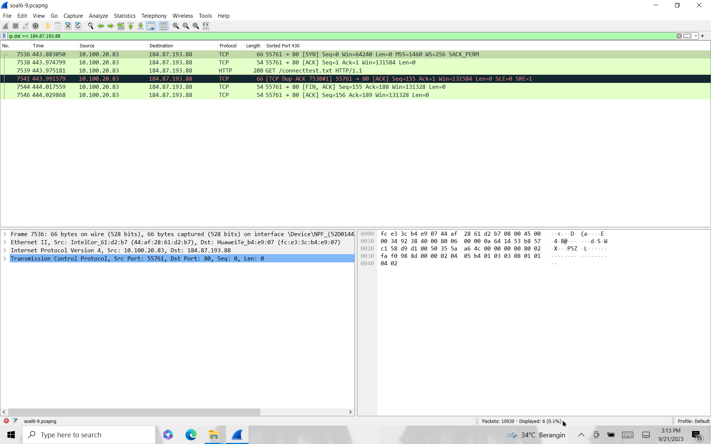

# Jarkom-Modul-1-E23-2023
Laporan Resmi Praktikum Jaringan Komputer
***
## Anggota Kelompok
1. Ilham Insan Wafi (5025211255)
2. Elmira Farah Azalia (5025211197)

---
### Soal 1
---
nc 10.21.78.111 12345

User melakukan berbagai aktivitas dengan menggunakan protokol FTP. Salah satunya adalah mengunggah suatu file.

a. Berapakah sequence number (raw) pada packet yang menunjukkan aktivitas tersebut? 

b. Berapakah acknowledge number (raw) pada packet yang menunjukkan aktivitas tersebut? 

c. Berapakah sequence number (raw) pada packet yang menunjukkan response dari aktivitas tersebut?

d. Berapakah acknowledge number (raw) pada packet yang menunjukkan response dari aktivitas tersebut?

---
### Jawaban
---
Search pada display filter:
```
ftp 
```
karena pada soal 1 mengambil contoh aktivitas mengunggah suatu file, maka bisa juga search dengan `STOR` (perintah unggah)
```
ftp.request.command == STOR
```


setelah itu pilih sesuai perintah,


pada sisi bawah terdapat beberapa panel, klik panel `Transmission Control Protocol..` untuk menemukan jawaban `1a,b`


Kemudian untuk `1c,d` karena perintah soal menunjukkan response dari aktivitas sebelumnya, maka kita bisa search pada display filter: 
```
ftp.response.code == 150
```
`150`= bentuk kode respons setelah klien mengirim perintah `STOR`
agar lebih cepat, langsung pilih packet setelah `STOR` tadi. Setelah itu langkahnya sama seperti `1a,b`


Untuk menjawab soal, copy`nc 10.21.78.111 12345`pada terminal, jika masih salah jangan berkecil hati, tetapi jika benar akan muncul flag untuk submit pada platform praktikum.


---
### Soal 2
---
nc 10.21.78.111 13579

Sebutkan web server yang digunakan pada portal praktikum Jaringan Komputer!

---
### Jawaban
---

Search pada display filter:
```
http.server
```

pilih salah satu packet dengan protocol `HTTP` kemudian klik kanan pilih `Follow` kemudian `TCP Stream`

muncul keterangan server untuk menjawab perintah soal.


Setelah itu copy`nc 10.21.78.111 13579`pada terminal, jika masih salah jangan frustasi, tetapi jika benar akan muncul flag untuk submit pada platform praktikum.


---
### Soal 3
---
nc 10.21.78.111 13590

Dapin sedang belajar analisis jaringan. Bantulah Dapin untuk mengerjakan soal berikut:

a. Berapa banyak paket yang tercapture dengan IP source maupun destination address adalah 239.255.255.250 dengan port 3702?

b. Protokol layer transport apa yang digunakan?

---
### Jawaban
---
Untuk menjawab soal nomor 3 kita melakukan search pada display filter:
```
ip.addr == 239.255.255.250 && udp.port == 3702
```
Tujuan dari filter diatas adalah untuk menyaring paket berdasarkan alamat IP sumber atau tujuan dengan  ip.addr == 239.255.255.250 . Pada filter tersebut juga terdapat parameter lain yaitu akan menampilkan paket dengan alamat IP 239.255.255.250.


Untuk menjawab soal no `3a` yaitu mengetahui banyak paket yang tercapture dengan IP source maupun destination address adalah 239.255.255.250 dengan port 3702 yaitu dengan cara melihat dibagian bawah tampilan file pcap pada wireshark terdapat keterangan bahwa displayed = 21. Maka dapat disimpulkan bahwa paket yang tercapture pada filter tersebut sebanyak 21. 

Untuk menjawab soal `3b` yaitu protokol layer transport apa yang digunakan, kita dapat melihat pada tampilan hasil filter seperti pada gambar diatas, terdapat keterangan di kolom protocol itu menggunakan UDP.

Setelah mengetahui jawaban tiap soal, copy`nc 10.21.78.111 13590`pada terminal, lalu akan muncul flag untuk submit pada platform praktikum jika jawabannya benar.


---
### Soal 4
---
nc 10.21.78.111 13591

Berapa nilai checksum yang didapat dari header pada paket nomor 130?

---
### Jawaban
---
Search pada display filter:
```
frame.number == 130
```

perintah tersebut akan mengarahkan langsung pada paket 130.

Lalu, pada sisi kiri bawah klik panel `User Data Protocol..` dapat-lah jawaban nilai cheksum.


Copy`nc 10.21.78.111 13591` pada terminal untuk mendapatkan kenyataan yang sebenarnya, jangan senang dahulu wahai manusia byasa. Jika berhasil dan mendapatkan flag, submit pada platform praktikum.


---
### Soal 5
---
Elshe menemukan suatu file packet capture yang menarik. Bantulah Elshe untuk menganalisis file packet capture tersebut.

a. Berapa banyak packet yang berhasil di capture dari file pcap tersebut?

b. Port berapakah pada server yang digunakan untuk service SMTP?

c. Dari semua alamat IP yang tercapture, IP berapakah yang merupakan public IP?

---
### Jawaban
---
Untuk menjawab soal ini, kita perlu terlebih dahulu mencari password untuk bisa membuka file connect pada file zip yang diberikan. Berikut langkah-langkah untuk menemukan password nya :
> Menganalisis isi paket dari pcap5
> Mencari protokol smtp untuk pengiriman email


> Mendapatkan body dari email yang berisikan password dari zip file.


> Password yang didapat perlu di decode terlebih dahulu dengan base64decode lalu mendapatkan hasil decode adalah 5implePas5word.


> Lalu gunakan password untuk membuka file connect


Untuk menjawab soal no `5a` yaitu mengetahui banyak paket yang tercapture dari file pcap tersebut yaitu dengan melihat dibagian bawah tampilan file pcap pada wireshark terdapat keterangan bahwa displayed = 60.


Untuk menjawab soal `5b` yaitu mengetahu port berapakah pada server yang digunakan untuk service SMTP. Kita dapat melihat dibagian Transmission Control Protocol terdapat keterangan bahwa destination port nya adalah 25.


Untuk menjawab soal `5c` kita dapat menganalisis IP yang merupakan public IP. Maka didapatkan yang termasuk public IP adalah 74.53.140.153


Setelah mengetahui jawaban tiap soal, copy`nc 10.21.78.111 11111`pada terminal, lalu akan muncul flag untuk submit pada platform praktikum jika jawabannya benar.


---
### Soal 6
---
nc 10.21.78.111 6666

Seorang anak bernama Udin Berteman dengan SlameT yang merupakan seorang penggemar film detektif. sebagai teman yang baik, Ia selalu mengajak slamet untuk bermain valoranT bersama. suatu malam, terjadi sebuah hal yang tak terdUga. ketika udin mereka membuka game tersebut, laptop udin menunjukkan sebuah field text dan Sebuah kode Invalid bertuliskan "server SOURCE ADDRESS 7812 is invalid". ketika ditelusuri di google, hasil pencarian hanya menampilkan a1 e5 u21. jiwa detektif slamet pun bergejolak. bantulah udin dan slamet untuk menemukan solusi kode error tersebut.

---
### Jawaban
---


---
### Soal 7
---
nc 10.21.78.111 6565

Berapa jumlah packet yang menuju IP 184.87.193.88?

---
### Jawaban
---
Search pada display filter:
```
ip.dst == 184.87.193.88
```

perintah akan menunjukkan semua paket dengan destinasi (tujuan) ip 184.87.193.88

pada sisi kanan bawah juga tercantum berapa total paket yang menuju ip tersebut.

Seperti biasa, copy`nc 10.21.78.111 6565` pada terminal, please jangan sombonk dulu, buktikanlah..buktikanlah.. jika sudah benar, bersyukur, submit ke platform praktikum.


---
### Soal 8
---
nc 10.21.78.111 7171

Berikan kueri filter sehingga wireshark hanya mengambil semua protokol paket yang menuju port 80! (Jika terdapat lebih dari 1 port, maka urutkan sesuai dengan abjad)

---
### Jawaban
---


---
### Soal 9
---
nc 10.21.78.111 7272

Berikan kueri filter sehingga wireshark hanya mengambil paket yang berasal dari alamat 10.51.40.1 tetapi tidak menuju ke alamat 10.39.55.34!

---
### Jawaban
---


---
### Soal 10
---
nc 10.21.78.111 7373

Sebutkan kredensial yang benar ketika user mencoba login menggunakan Telnet

---
### Jawaban
---


